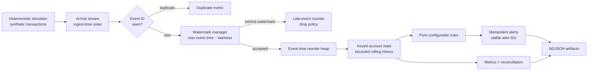

# Real-time Fraud Streaming — Synthetic Reference Implementation

> **Portfolio demo — synthetic data only.** This repository is an educational
> reference implementation. It has not processed real financial data, is not
> deployed to production, and must not be used to make real fraud decisions.

A dependency-free Python implementation of the hard parts of stateful stream
processing: event-time ordering, watermarks, bounded keyed state, deduplication,
deterministic replay, configurable rules, and observable outcomes.

## Why this project exists

The code is intentionally small enough to audit end to end. It demonstrates
streaming semantics without hiding them behind a framework:

- deterministic synthetic arrivals, including duplicates and delayed events;
- event-time processing with a configurable allowed-lateness watermark;
- explicit handling for out-of-order and too-late records;
- stable event and alert identifiers for replay-safe output;
- per-account rolling state for amount, velocity, and country-hop signals;
- exact decimal arithmetic for money;
- metrics and NDJSON artifacts suitable for reconciliation;
- dependency-free tests that do not need Kafka, a database, or cloud credentials.

## Architecture



The local process models concepts normally supplied by Flink, Spark Structured
Streaming, Kafka Streams, or Beam. The mapping to production components is
documented in [ADR 0001](docs/adr/0001-event-time-state-and-idempotency.md).

## Correctness contracts

| Concern | Contract in this demo |
|---|---|
| Event time | State and rules observe events in event-time order, not arrival order. |
| Watermark | `max_observed_event_time - allowed_lateness`; accepted buffered events at or before it are evaluated. |
| Late data | Events older than the watermark are counted and dropped explicitly. |
| Deduplication | A logical `event_id` is evaluated at most once in a pipeline run. |
| Alert idempotency | `alert_id` is a stable hash of event ID and matched signal names. |
| State bound | Per-account history is evicted beyond configured retention. |
| Money | Amounts use `Decimal`; the wire format represents them as strings. |
| Replay | Simulator seed, config, and input order produce byte-stable logical results. |

## Run it

Python 3.11 or newer is required. Runtime dependencies: none.

```bash
make check
make demo
```

The demo writes:

```text
artifacts/
├── alerts.ndjson   # deterministic rule outcomes
├── events.ndjson   # synthetic arrivals, including controlled duplicates
└── metrics.json    # counters, gauges, watermark, and demo provenance
```

Use a different deterministic scenario:

```bash
PYTHONPATH=src python -m fraud_streaming \
  --events 250 \
  --seed 2026 \
  --accounts 20 \
  --config config/rules.json \
  --output-dir artifacts
```

Run the same finite demo in a container:

```bash
docker compose run --rm demo
```

An illustrative Redpanda service is isolated behind a Compose profile:

```bash
docker compose --profile broker up redpanda
```

The current Python demo does **not** connect to that broker. The service is
included to make the intended local integration seam concrete without turning
an offline correctness test into an infrastructure test.

## Rules

All behavior-changing values live in [`config/rules.json`](config/rules.json):

- `high_amount`: one transaction meets a configured amount threshold;
- `velocity`: count and aggregate amount cross thresholds inside a rolling window;
- `country_hop`: one account appears in another country inside a rolling window.

Signals contribute a score capped at 100. An alert is emitted only when the
combined score reaches `alert_score_threshold`. These are deliberately
explainable rules, not a claim of a trained fraud model.

## Repository map

```text
.
├── config/rules.json
├── docs/
│   ├── OPERATIONS.md
│   └── adr/0001-event-time-state-and-idempotency.md
├── src/fraud_streaming/
│   ├── cli.py
│   ├── config.py
│   ├── metrics.py
│   ├── models.py
│   ├── pipeline.py
│   ├── rules.py
│   └── simulator.py
├── tests/
├── .github/workflows/ci.yml
├── Dockerfile
└── docker-compose.yml
```

## Test strategy

`make check` compiles the package and runs unit plus finite-stream integration
tests. Coverage includes:

- deterministic generator output and controlled duplicate injection;
- timezone and exact-money serialization;
- out-of-order reordering and too-late-event behavior;
- duplicate suppression and stable alert identity;
- rolling velocity and country-hop state;
- end-to-end accounting invariants and auditable artifact creation.

GitHub Actions exercises Python 3.11 and 3.12, runs a deterministic scenario,
uploads its synthetic artifacts, and smoke-tests the container image.

## Productionization path

| Demo component | Production analogue | Additional controls needed |
|---|---|---|
| Tuple of arrivals | Kafka/Redpanda topic | Schema Registry, compatibility policy, ACLs, TLS |
| In-memory heap | Framework event-time operator | Checkpoints, backpressure, partition strategy |
| Python set dedupe | Durable keyed state | TTL, recovery semantics, replay tests |
| Account deque | RocksDB/state store | State sizing, compaction, rescaling |
| NDJSON alerts | Transactional sink/topic | Exactly-once or idempotent sink contract |
| JSON metrics | Prometheus/OpenTelemetry | SLOs, dashboards, paging and runbooks |
| Static rules | Versioned rule service | Approval workflow, shadow evaluation, rollback |

Before any real use, add privacy review, encryption and secrets management,
schema governance, model/rule risk controls, human review, audit retention,
load and recovery testing, and regional regulatory assessment.

## Honest scope and limitations

- All people, accounts, merchants, devices, and transactions are synthetic.
- State and dedupe memory are process-local and intentionally bounded to a demo run.
- The country-hop rule is illustrative; it is not a geospatial impossibility model.
- The project measures correctness, not production throughput or latency.
- The broker configuration is illustrative and is not wired into the application.

See [OPERATIONS.md](docs/OPERATIONS.md) for invariants, failure modes, and a
practical production-readiness checklist.

